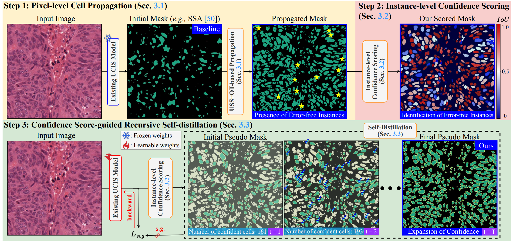

# COIN: Confidence Score-Guided Distillation for Annotation-Free Cell Segmentation

This repository provides the official implementation of **COIN**, a fully annotation-free framework for cell instance segmentation.  
COIN boosts existing UCIS models (e.g., SSA [50]) by recovering error-free instances and distilling them into highly confident pseudo labels—**without any image-level annotations or ground-truth masks**.

> 📄 **Paper**: [COIN: Confidence Score-Guided Distillation for Annotation-Free Cell Segmentation](https://arxiv.org/pdf/2503.11439)  
> 🔗 **Project Page**: [https://shjo-april.github.io/COIN](https://shjo-april.github.io/COIN)



## 📰 News

- 📅 **ICCV 2025**: Our paper has been officially accepted to the **IEEE/CVF International Conference on Computer Vision (ICCV) 2025**, to be held in October 2025.
- 💻 **Coming Soon**: We're currently refactoring the codebase for cleaner modularity and improved reproducibility.
- 🚀 **Hugging Face Demo**: A live demo and pre-trained model checkpoints will soon be released via [🤗 Hugging Face Hub](https://huggingface.co/models).


## 📌 Citation

If you use this code or find it helpful, please consider citing:

```
@InProceedings{jo2025coin,
      title={COIN: Confidence Score-Guided Distillation for Annotation-Free Cell Segmentation}, 
      author={Sanghyun Jo and Seo Jin Lee and Seungwoo Lee and Seohyung Hong and Hyungseok Seo and Kyungsu Kim},
      booktitle={Proceedings of the IEEE/CVF International Conference on Computer Vision (ICCV)},
      year={2025}
}
```

## 📦 Installation

Set up the environment using:

```bash
python3 -m venv venv
source ./venv/bin/activate

python3 -m pip install -r requirements.txt
python3 -m pip install -U "ray[default]" # parallel inference (infer_masks.py)
python3 -m pip install git+https://github.com/lucasb-eyer/pydensecrf.git # for CRF
python3 -m pip install torch==1.13.1+cu117 torchvision==0.14.1+cu117 torchaudio==0.13.1 --extra-index-url https://download.pytorch.org/whl/cu117
```

## 📁 Datasets

We provide all **six datasets** used in COIN experiments, available under the `./data/` directory:

- `MoNuSeg`
- `TNBC`
- `CPM-17`
- `CryoNuSeg`
- `PanNuke`
- `BRCA`

Each dataset is organized using a **consistent folder structure**, allowing for seamless integration into the pipeline.

### 📦 Dataset Directory Structure

```
./data/
├── BRCA/
│   ├── train/
│   │   ├── image/
│   │   └── mask/
│   └── test/
│       ├── image/
│       └── mask/
├── CPM-17/
│   ├── train/
│   │   ├── image/
│   │   └── mask/
│   └── test/
│       ├── image/
│       └── mask/
├── CryoNuSeg/
│   ├── train/
│   │   ├── image/
│   │   └── mask/
│   └── test/
│       ├── image/
│       └── mask/
├── MoNuSeg/
│   ├── train/
│   │   ├── image/
│   │   └── mask/
│   └── test/
│       ├── image/
│       └── mask/
├── PanNuke/
│   ├── Fold1/       # Used as part of training
│   │   ├── image/
│   │   └── mask/
│   ├── Fold2/       # Used as part of training
│   │   ├── image/
│   │   └── mask/
│   └── Fold3/       # Used as test set
│       ├── image/
│       └── mask/
└── TNBC/
    ├── train/
    │   ├── image/
    │   └── mask/
    └── test/
        ├── image/
        └── mask/
```

Each dataset follows the structure:  
```
./data/{dataset}/{domain}/{image or mask}/
```

- For most datasets, `domain` is `train/` or `test/`
- For **PanNuke**, we follow a 3-fold split:
  - `Fold1` + `Fold2` are used for **training**
  - `Fold3` is used for **testing**

> ✅ No manual reorganization needed — all datasets are ready for use with the provided scripts.

### 📚 Dataset Licenses & Usage

All six datasets used in this repository were restructured into a consistent folder format to support easy plug-and-play training and evaluation:

```
./data/{dataset}/{domain}/image/
./data/{dataset}/{domain}/mask/
```

Each dataset is redistributed under its original license, with full attribution to the source authors.  
You can find detailed license information and links in [LICENSES.md](./LICENSES.md).

> ⚠️ **Note**: The CPM-17 dataset is not redistributed here due to unclear licensing. Please download it manually from [this repository](https://github.com/nauyan/NucleiSegmentation).

## 🧩 Step 1: Pixel-level Cell Propagation

```bash
# Extract patch-wise USS features from histopathology images using a backbone (e.g., MAE with ViT-B).
# These features are later used to refine the coarse cell masks from a UCIS model.
python3 step1_extract_features_uss.py --uss MAE --backbone ViT-B --data MoNuSeg --domain train --zoom 6 --scales 1.0 --hflip

# Refine initial cell masks using USS features and optimal transport (OT).
# This improves foreground–background separation and ensures the presence of error-free instances.
python3 step1_refine_masks_with_OT.py --uss "./temp/MoNuSeg_MAE@ViT-B/train_{}@hflip/" --scales 6 --ot \
--pred "./submissions/SSA@MoNuSeg@best/train_instance/" --mask "./submissions/Ours+SSA@MoNuSeg@Step1/train/" --accumulate_centroids
```

## 🧠 Step 2: Instance-level Confidence Scoring

```bash
# Convert refined semantic masks from Step 1 into instance-level masks using connected component labeling and watershed.
# These instance masks will be evaluated for confidence via consistency with SAM-generated masks.
python3 step2_generate_instance_masks.py --data MoNuSeg --domain train --tag "Ours+SSA@MoNuSeg@Step1"

# Score each instance by comparing it with a SAM-generated mask prompted at its center point.
# Instances with high consistency (IoU > mean + std) are retained as confident masks for self-distillation.
python3 step2_score_instances_with_SAM.py --pred "./submissions/Ours+SSA@MoNuSeg@Step1/train_instance/" --mask "./submissions/Ours+SSA@MoNuSeg@Step1/train_sam/" --strategy mean+std 
```

## 🔁 Step 3: Confidence Score-guided Recursive Self-distillation

```bash
# Train the model using confident pseudo masks from Step 2 (binary masks only; no edge decoder is used).
# This step performs recursive self-distillation to refine predictions and expand confidence progressively.
python3 step3_train_self_distillation.py --gpus 0 --mask "./submissions/Ours+SSA@MoNuSeg@Step1/train_sam/" --tag "Ours+SSA@MoNuSeg@Self-Distillation" --nesterov --scales 100

# Run inference on the test set using the self-distilled model to generate final semantic segmentation predictions.
python3 produce_masks.py --data MoNuSeg --gpus 0 --domain test --tag "Ours+SSA@MoNuSeg@Self-Distillation" --pred "./submissions/Ours+SSA@MoNuSeg@Self-Distillation/test/" --checkpoint last

# Convert the predicted semantic masks from the test set into instance-level outputs using the same semantic-to-instance method from Step 2.
# Note: We reuse watershed-based instance generation instead of training a separate edge decoder.
python3 step2_generate_instance_masks.py --data MoNuSeg --domain test --tag "Ours+SSA@MoNuSeg@Self-Distillation"
```

## 🧪 Experiments

After completing all steps, evaluate segmentation quality on the MoNuSeg test set:

### ▶️ Baseline (SSA only)
```bash
python evaluate.py --data MoNuSeg --domain test --tag "SSA@MoNuSeg@best"
```

| Metric     | Value  |
|------------|--------|
| AJI        | 0.259  |
| PQ         | 0.185  |
| IoU        | 0.618  |
| Dice       | 0.575  |

---

### ✅ COIN (Ours + SSA)
```bash
python evaluate.py --data MoNuSeg --domain test --tag "Ours+SSA@MoNuSeg"
```

| Metric | Value | 
|--------|----------------|
| AJI    | 0.580 (+0.321) |
| PQ     | 0.536 (+0.351) |
| IoU    | 0.776 (+0.158) |
| Dice   | 0.794 (+0.219) |

> 🔎 **Summary**:  
> COIN more than doubles the AJI score of the baseline and significantly improves all key metrics—**without using any annotations**.


## 🙋‍♀️ Contact

For questions or feedback, feel free to reach out via [GitHub Issues](https://github.com/shjo-april/COIN/issues) or email:

- shjo.april [at] gmail.com